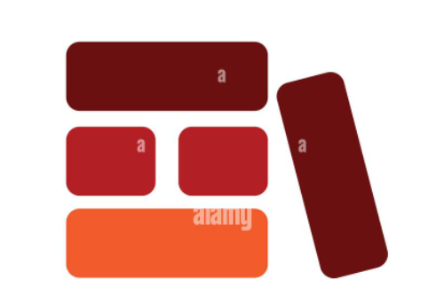

<p align="center">
  <a href="https://www.npmjs.com/package/vinyl-component-blocks">
     
  </a>
</p>

<h1 align="center">Vinyl Component Blocks ⚡️</h1>
<br />

<p align="center">


  

<a href="https://github.com/Vinyl-Davyl/vinyl-component-blocks/blob/main/CONTRIBUTING.md">
  
</a>
<a href="https://vinyldavyl.xyz">
  
</a>

</p>

<br />

<p align="center">
   Vinyl Component Blocks is a UI component library designed to help you quickly build beautiful and functional user interfaces for your web applications. This library provides a collection of reusable and customizable React components that cover a wide range of UI elements.
</p>

<br />

## Introduction

Offering a set of commonly used components that are designed to be easy to use, highly customizable, and visually appealing. Whether you're building a simple login form, a complex dashboard interface or seeking inspiration while building components in your development process, Vinyl Component(VC) Blocks has the basic components you need to create a polished user experience.

<br />

## Installation and Setup 🧱

You can install Vinyl Component Blocks via npm or yarn:

```bash
npm install vinyl-component-blocks
```

or

```bash
yarn add vinyl-component-blocks
```

## Usage

Once installed, you can import the components you need from Vinyl Component Blocks and use them in your React application:

```jsx
import React from "react";
import {
  Button,
  FormControl,
  Link,
  Search,
  Select,
  Skeleton,
  Spinner,
  TextInput,
  Typography,
  Avatar,
  Card,
  Modal,
  Header,
} from "vinyl-component-blocks";
```

### Demo Example Combining Components

```jsx
import React from "react";
import { Button, Card, Avatar } from "vinyl-component-blocks";

const DemoComponent = () => (
  <div>
    <Card backgroundColor="#f0f0f0" padding="20px">
      <Avatar imageSrc="https://example.com/avatar.jpg" />
      <h2>John Doe</h2>
      <p>Lorem ipsum dolor sit amet, consectetur adipiscing elit.</p>
      <Button type="primary" size="medium">
        Read More
      </Button>
    </Card>
  </div>
);

export default DemoComponent;
```

<br />

- Providing a hands-on experience with the Vinyl Component Blocks library, showcasing the versatility and functionality of each component. Key components here include the `Header` and `Login` UI components.

<br />

```jsx
import React from "react";
import { Button, Card, Avatar, Header, Login } from "vinyl-component-blocks";

const DemoComponent = () => (
  <div>
    <Header
      user={{ name: "John Doe" }}
      onLogout={() => console.log("Logged out")}
    />
    <Card backgroundColor="#f0f0f0" padding="20px">
      <Avatar imageSrc="https://example.com/avatar.jpg" />
      <h2>John Doe</h2>
      <p>Lorem ipsum dolor sit amet, consectetur adipiscing elit.</p>
      <Button type="primary" size="medium">
        Read More
      </Button>
    </Card>
    <Login
      onLogin={() => console.log("Logged in")}
      onCreateAccount={() => console.log("Creating account")}
    />
  </div>
);

export default DemoComponent;
```

## Components

### Button

| Prop      | Type        | Description                                                 |
| --------- | ----------- | ----------------------------------------------------------- |
| type      | string      | Button type (`default`, `danger`, `ghost`, `secondary` )    |
| size      | string      | Button size (`default`, `large`, `small`)                   |
| disabled  | boolean     | Disable button                                              |
| onClick   | function    | Click event handler                                         |
| children  | ReactNode   | Button content                                              |
| icon      | ElementType | Icon component to display alongside the button text         |
| className | string      | Additional CSS classes for styling                          |
| loading   | boolean     | Specify whether the button should display a loading spinner |
| href      | string      | URL for the button if it should act as a link               |
| as        | ElementType | HTML element type for the button                            |
| to        | string      | Destination path for the link if using the 'as' prop        |
| ...rest   | any         | Additional props for customization                          |

### FormControl

| Prop       | Type      | Description                        |
| ---------- | --------- | ---------------------------------- |
| label      | string    | Label for the form control         |
| htmlFor    | string    | ID of the form control element     |
| error      | string    | Error message to display           |
| hint       | string    | Hint message to display            |
| disabled   | boolean   | Disable the form control           |
| className  | string    | Additional CSS classes for styling |
| children   | ReactNode | Form control element               |
| onBlur     | function  | Blur event handler                 |
| onFocus    | function  | Focus event handler                |
| forceLabel | boolean   | Force label to always show         |
| ...rest    | any       | Additional props for customization |

### Link

| Prop      | Type        | Description                        |
| --------- | ----------- | ---------------------------------- |
| disabled  | boolean     | Disable the link                   |
| className | string      | Additional CSS classes for styling |
| children  | ReactNode   | Link text                          |
| as        | ElementType | HTML element type (default is `a`) |
| href      | string      | Link URL                           |
| ...rest   | any         | Additional props for customization |

### Search

| Prop        | Type          | Description                                            |
| ----------- | ------------- | ------------------------------------------------------ |
| className   | string        | Additional CSS classes for styling                     |
| size        | ComponentSize | Size of the search input (`default`, `small`, `large`) |
| width       | string        | Width of the search input                              |
| value       | string        | Current value of the search input                      |
| onChange    | function      | Change event handler for the search input              |
| placeholder | string        | Placeholder text for the search input                  |

### Select

| Prop        | Type           | Description                                            |
| ----------- | -------------- | ------------------------------------------------------ |
| className   | string         | Additional CSS classes for styling                     |
| size        | ComponentSize  | Size of the select input (`default`, `small`, `large`) |
| disabled    | boolean        | Disable the select input                               |
| error       | boolean        | Indicate error state                                   |
| width       | string         | Width of the select input                              |
| option      | SelectOption   | Selected option                                        |
| listOptions | SelectOption[] | Array of options for the select input                  |
| onChange    | function       | Change event handler for the select input              |
| placeholder | string         | Placeholder text for the select input                  |

### Skeleton

| Prop         | Type   | Description                           |
| ------------ | ------ | ------------------------------------- |
| width        | number | Width of the skeleton element         |
| height       | number | Height of the skeleton element        |
| className    | string | Additional CSS classes for styling    |
| borderRadius | string | Border radius of the skeleton element |

### Spinner

| Prop      | Type    | Description                        |
| --------- | ------- | ---------------------------------- |
| size      | number  | Size of the spinner                |
| className | string  | Additional CSS classes for styling |
| light     | boolean | Use light spinner variant          |

### TextInput

| Prop        | Type          | Description                                     |
| ----------- | ------------- | ----------------------------------------------- |
| icon        | ElementType   | Icon component to display                       |
| size        | ComponentSize | Size of the input (`default`, `small`, `large`) |
| disabled    | boolean       | Disable the input                               |
| error       | boolean       | Indicate error state                            |
| value       | string        | Current value of the input                      |
| onChange    | function      | Change event handler for the input              |
| placeholder | string        | Placeholder text for the input                  |
| width       | string        | Width of the input                              |
| readonly    | boolean       | Make the input read-only                        |
| clearable   | boolean       | Allow clearing the input                        |
| ...rest     | any           | Additional props for customization              |

### Typography

| Prop      | Type      | Description                                |
| --------- | --------- | ------------------------------------------ |
| variant   | string    | Typography variant (`h1`, `h2`, `h3`)      |
| align     | string    | Text alignment (`center`, `right`, `left`) |
| className | string    | Additional CSS classes for styling         |
| children  | ReactNode | Text content                               |

### Avatar

| Prop     | Type   | Description                     |
| -------- | ------ | ------------------------------- |
| imageSrc | string | Source URL for the avatar image |

### Card

| Prop            | Type      | Description                                |
| --------------- | --------- | ------------------------------------------ |
| backgroundColor | string    | Background color of the card               |
| children        | ReactNode | Content to be displayed within the card    |
| padding         | string    | Padding around the content inside the card |

### Modal

| Prop     | Type      | Description                              |
| -------- | --------- | ---------------------------------------- |
| children | ReactNode | Content to be displayed within the modal |

### Header

| Prop            | Type     | Description                             |
| --------------- | -------- | --------------------------------------- |
| user            | User     | User object                             |
| onLogin         | function | Event handler for login action          |
| onLogout        | function | Event handler for logout action         |
| onCreateAccount | function | Event handler for create account action |

## External Resources and Dependencies 🌐

The Vinyl Component Blocks library relies on the following external resources and dependencies:

- **Styled Components**: Utilized for customizable styling of components. CSS-in-JS library.

- **React**: Serves as the core of the Vinyl Component Blocks, providing the necessary infrastructure for building user interfaces in JavaScript.

- **TypeScript**: Vinyl Component Blocks is super strictly typed. TypeScript as a strict syntactical superset of JavaScript adds static typing to the library. It enhances developer productivity and code quality.

- **Email Validator**: Used for validating emails, for the input-component most specifically. Email Validator is a dependency that helps ensure that the entered email addresses conform to standard email format rules, enhancing the reliability and accuracy of user input validation.

## Demo Examples 🛠️

### Customizing TextInput Component

```jsx
import React from "react";
import { TextInput } from "vinyl-component-blocks";

const CustomTextInput = () => (
  <TextInput
    className="custom-text-input"
    icon={YourIconComponent}
    size="large"
    disabled={false}
    error={false}
    value="Hello"
    onChange={(e) => console.log(e.target.value)}
    placeholder="Enter text here"
    width="200px"
    readonly={false}
    clearable={true}
  />
);

export default CustomTextInput;
```

### Demo Example, Simple Login UI

```jsx
import React from "react";
import { Header, Login } from "vinyl-component-blocks";

const HeaderWithLogin = () => (
  <div>
    <Header
      user={{ name: "John Doe" }}
      onLogout={() => console.log("Logged out")}
    />
    <Login
      onLogin={() => console.log("Logged in")}
      onCreateAccount={() => console.log("Creating account")}
    />
  </div>
);

export default HeaderWithLogin;
```

### Customizing Components with Custom CSS Styles ✨

Customizing components with custom CSS styles allows you to tailor the appearance of UI components to match the specific design requirements of your project. Applying custom CSS classes to components, you can override default styles and apply unique visual enhancements. This approach offers flexibility and control over the presentation of components.

#### Customizing Card Component

```jsx
import React from "react";
import { Card } from "vinyl-component-blocks";
import "./custom-styles.css";

const CustomCard = () => (
  <Card
    backgroundColor="#f0f0f0"
    padding="20px"
    className="custom-card" // Custom CSS class for styling
  >
    <h2>This is a Custom Card</h2>
    <p>
      Stop reinventing the wheel! Our well-documented component library empowers
      you to concentrate on building unique features and functionalities.
    </p>
  </Card>
);

export default CustomCard;
```

#### Customizing TextInput Component

```jsx
import React from "react";
import { TextInput } from "vinyl-component-blocks";
import "./custom-styles.css";

const CustomTextInput = () => (
  <TextInput
    className="custom-text-input" // Custom CSS class for styling
    icon={YourIconComponent}
    size="large"
    disabled={false}
    error={false}
    value="Hello"
    onChange={(e) => console.log(e.target.value)}
    placeholder="Enter text here"
    width="200px"
    readonly={false}
    clearable={true}
  />
);

export default CustomTextInput;
```

In the `custom-styles.css` file:

```css
/* custom-styles.css */
.custom-card {
  box-shadow: 0 4px 8px rgba(0, 0, 0, 0.1);
  border-radius: 12px;
}

.custom-text-input {
  border: 2px solid #cccccc;
  border-radius: 8px;
}
```

## Contributing

### Adding New Components

Contributions from developers who feel the need to expand the library with new components or features. Whether you've identified a potential component, have an idea for a new feature, or want to enhance existing functionality, your contributions are valuable to the community.

If you find something that piques your interest or if the project has inspired you, feel free to contribute by submitting pull requests(PRs). Your contributions help improve the library for everyone. Don't forget to leave a star ⭐ on GitHub to show your support!

## Conclusion

Vinyl Component Blocks offers a comprehensive collection of UI components that are easy to use and highly customizable. Say goodbye to design inconsistencies.

So, stop reinventing the wheel! Our well-documented component library empowers you to create, clone and build unique component features and functionalities to your taste.

Stop repeating work! Install, call, use, modify.
`npm install vinyl-component-blocks`.
